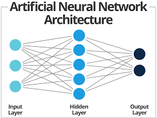
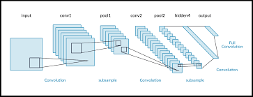
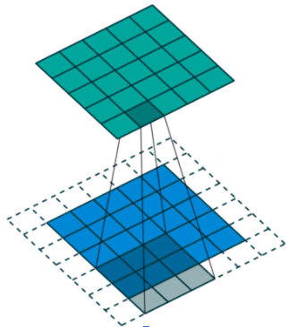
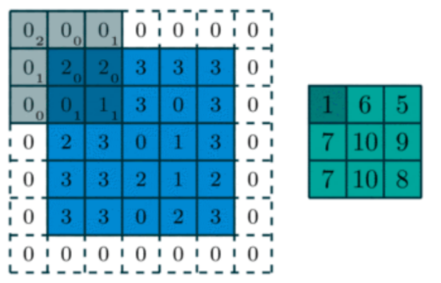
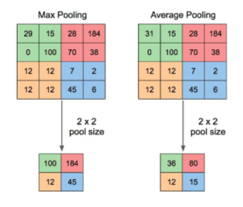
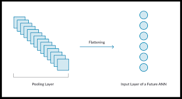

# Week 7 Practice Problems

Please read the following sections and complete the corresponding tasks by the next meeting.

This week, we will be building on top of the skills you learned last week with building a model. However, instead of using solely the dense layer, we will be introducing two new types of layers: the Convolutional layer, and the max-pooling layer!

## Creating a CNN

Defining a model starts the same way, with the placebo Input layer. 

```python
input_layer = tf.keras.layers.Input((784,))  # (784,) is the input data's shape
```

However, recall the nature of a convolutional network. Instead of a vectorized input, convolutional networks can take in the "full picture" in its original 2D format. Will expecting an input of shape (784, ) work while using a convolutional network? Think about how we got the number 784. How would we change this line to accept the images in their original 28 by 28 format? (images are in grayscale)

|  |  |
|-----------------|-----------------|

### Convolutional Layer

The first layer of a CNN is the convolutional layer. Recall that the convolutional layer performs operations known as convolutions on its input data (represented by the blue grid). We multiply our input data element-wise by a `kernel`, or a weight matrix (in the image to the right, this is represented by the numbers in the bottom right corners of the shaded region), and sum the resulting matrix into a single scalar value. This process is repeated as we move this kernel over the input data, until we have completely populated the resulting `feature map` (represented by the green grid), which is simply a condensed expression of the original input data, filtered by a kernel. 


|  |  |
|-------------------------|--------------------------|


### Pooling Layer

Recall that we discussed two types of `pooling layers` in last week's discussion, average and max pooling. Pooling layers serve to help reduce the parameter count of our model, and operate similarly to convolutional layers. However, instead of applying a kernel to each section of the input data, a pooling layer performs a uniform operation. In the case of max pooling, it simply takes the max value it sees as it travels over the input data. Looking at the image below, see if you can figure out what average pooling is!

|  |
|---------------------|

While both forms of pooling are viable, for this assignment, we will be focusing only on max pooling for the assignment. 


## Building a model

### Task

Use the same data loading code that we used from last week to load in the MNIST dataset. See if you can do it without referencing back to last week's solution to test your understanding!

### Task

After setting up your Input, visit this link (https://www.tensorflow.org/api_docs/python/tf/keras/layers/Conv2D) to try and understand the Conv2D layer object. This will be the first layer in your CNN, and will take as input the Input placebo that you defined in the line before. 

You will need to include the following parameters, each of which is defined on the docs:

```python
Conv2D(filters=4, kernel_size=(4, 4), data_format="channels_last", activation="sigmoid", input_shape=(?))
```

What do you need to put in for input shape?

### Task

The next layer you will need is a single max pooling layer. Visit this link (https://www.tensorflow.org/api_docs/python/tf/keras/layers/MaxPool2D) to learn more about its implementation. Choose a pool size of (2, 2) when you add it to your network. 


### Task

Now comes the part where we connect our convolutional and pooling layers to a traditional MLP! However, recall that an MLP takes in vectorized input only. At this point, we have created 4 separate 2D filters, each pooled separately to give us data of shape (4 * n * n). This is NOT compatible with the `Dense` layer you learned about last week. In order to ammend this issue, we `flatten` our data down to 1D.


|  |
|---------------------|


Visit this link (https://www.tensorflow.org/api_docs/python/tf/keras/layers/Flatten) to learn more about implementation.

By this point, your data is compatible with traditional dense layers! Add two or three after the Flatten layer, and you're good to go! You can mostly copy the same code you had last week for training the network, but be careful about your data's shape. Recall that we are no longer inputting vectorized image data into the network, but the original (28, 28, 1) shaped image matrix!

* Note: this week's util.py is slightly different from last weeks. Be sure that you are using this week's util.py to access the predict_and_disp method. 

Play around with learning rate and model architecture to get the best results!
